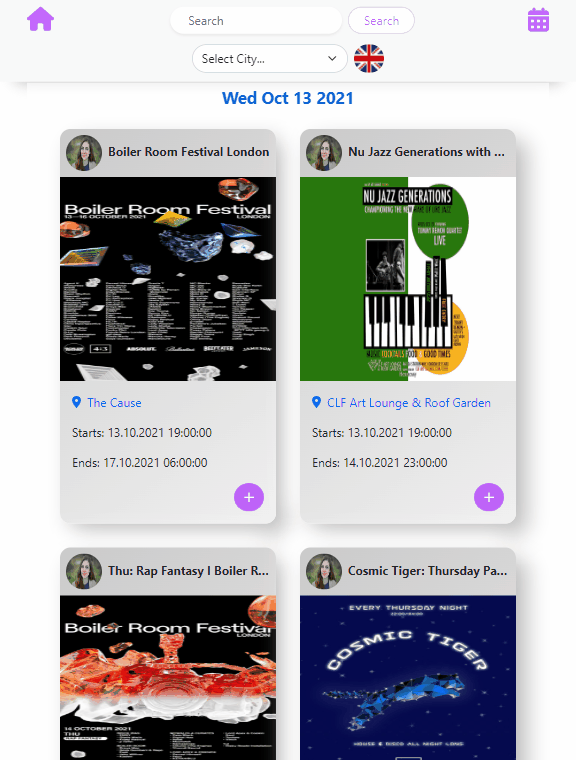

## An Event App

<a href="https://polatevents.netlify.app/" target="_blank"><h3 align="left">Click here for demo</h3></a>

## Table of Contents

- [General info](#general-info)
- [Preview](#preview)
- [Technologies](#technologies)
- [Contact](#contact)

## General Info

This is an Event App. You can find lots of Events from London and Berlin. 
When you run this app in your local, should you clone (git.clone).
Then you should first type "npm install" and then "npm start".

## Preview

### Desktop

### Tablet

### Mobile

## Technologies

- HTML
- CSS
- SCSS
- Bootstrap
- JavaScript
- React
- React Router Dom
- UseContext
- FontAwesome
- Github

## Contact

Created by SIDDIK - feel free to contact us for any inquiries!
